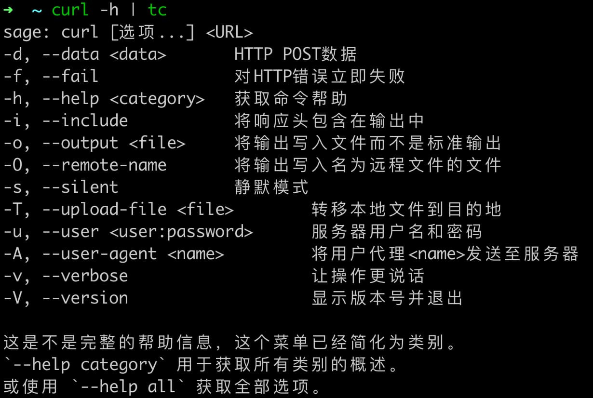

English | [中文](README_ZH_CN.md)


## Introduction

Execute commands and use LLM to translate output.


## Download
- Option 1: Compile it yourself with **docker** (linux or mac) 
  - `git clone https://github.com/NezhaFan/translate-cli.git`
  - `cd translate-cli && chmod +x build.sh && sh build.sh`
- Option 2: if you r a gopher
  - `go install github.com/NezhaFan/translate-cli@latest` 
  - `mv $GOPATH/bin/translate-cli $GOPATH/bin/tc`

## Config
set env (for example in mac)
```conf
# tradnslated language
export TC_LANG=Chinese
# ollama or empty
export TC_LLM_TYPE=ollama
export TC_LLM_URL=http://127.0.0.1:11434
# use small model, don't use deep thinking model
export TC_LLM_MODEL=qwen2.5:3b
# if not ollama it is required
export TC_LLM_KEY=sk-
```

## Give me star 🌟！ Please!
