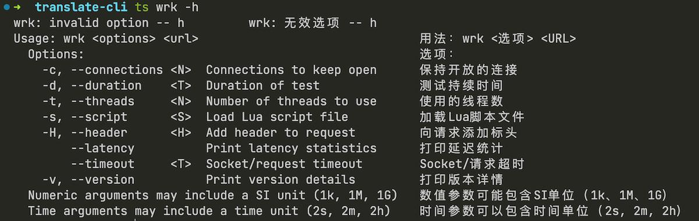

# Translate-Cli

English | [中文](README_ZH_CN.md)

Execute the command and translate the output. translate by

# Demo
- Not Use translate-cli

- Use translate-cli


### Download
- download
  - download program from `relase` 
  - when you are a gopher : `go install github.com/NezhaFan/translate-cli@latest`
### Model
 set env (for example in mac)
```conf
export TRANSLATE_LANG=Chinese
export TRANSLATE_LLM_TYPE=ollama
export TRANSLATE_LLM_URL=https://api.openai.com
export TRANSLATE_LLM_MODEL=
export TRANSLATE_LLM_KEY=xxxx
```

# Use
you can have a try  `./tc curl -h` 