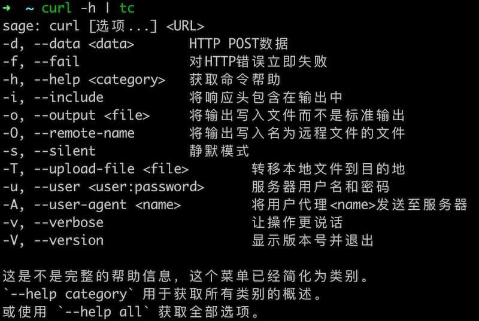

##  English | [中文](README.md)


## Introduction

Execute commands and use LLM to translate output.


## Download
- Option 1: Only use **docker**
  - `git clone https://github.com/NezhaFan/translate-cli.git`
  - `docker build -t tc .` 
  - Set to short environment variables. for example: `alias tc='docker run --rm -i --tty=false -e LLM_URL=http://api.openai.com -e LLM_MODEL=gpt-4o -e LLM_KEY=sk-xxx tc'`
- Option 2: Compile it yourself with **docker** (linux or mac) 
  - `git clone https://github.com/NezhaFan/translate-cli.git`
  - `cd translate-cli && chmod +x build.sh && sh build.sh`
- Option 3: if you r a gopher
  - `go install github.com/NezhaFan/translate-cli@latest` 
  - `mv $GOPATH/bin/translate-cli $GOPATH/bin/tc`

## Config (When Option 2 or Option 3)
set env (for example in mac)
```conf
export LANG=Chinese
export LLM_URL=http://api.openai.com
export LLM_MODEL=
export LLM_KEY=
```

## Run
Transmission by pipeline `curl -h | tc`

## Give me star 🌟！ Please!
